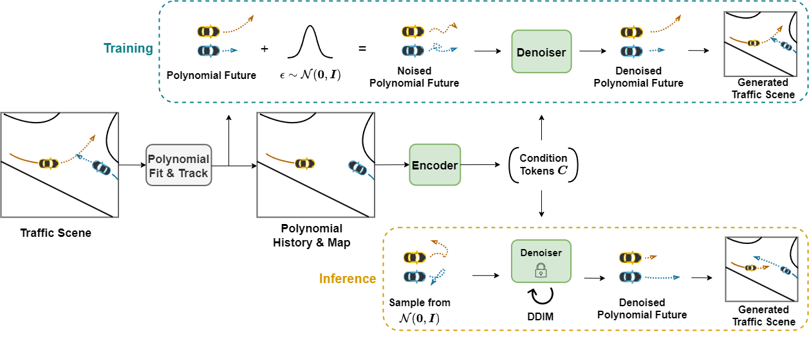
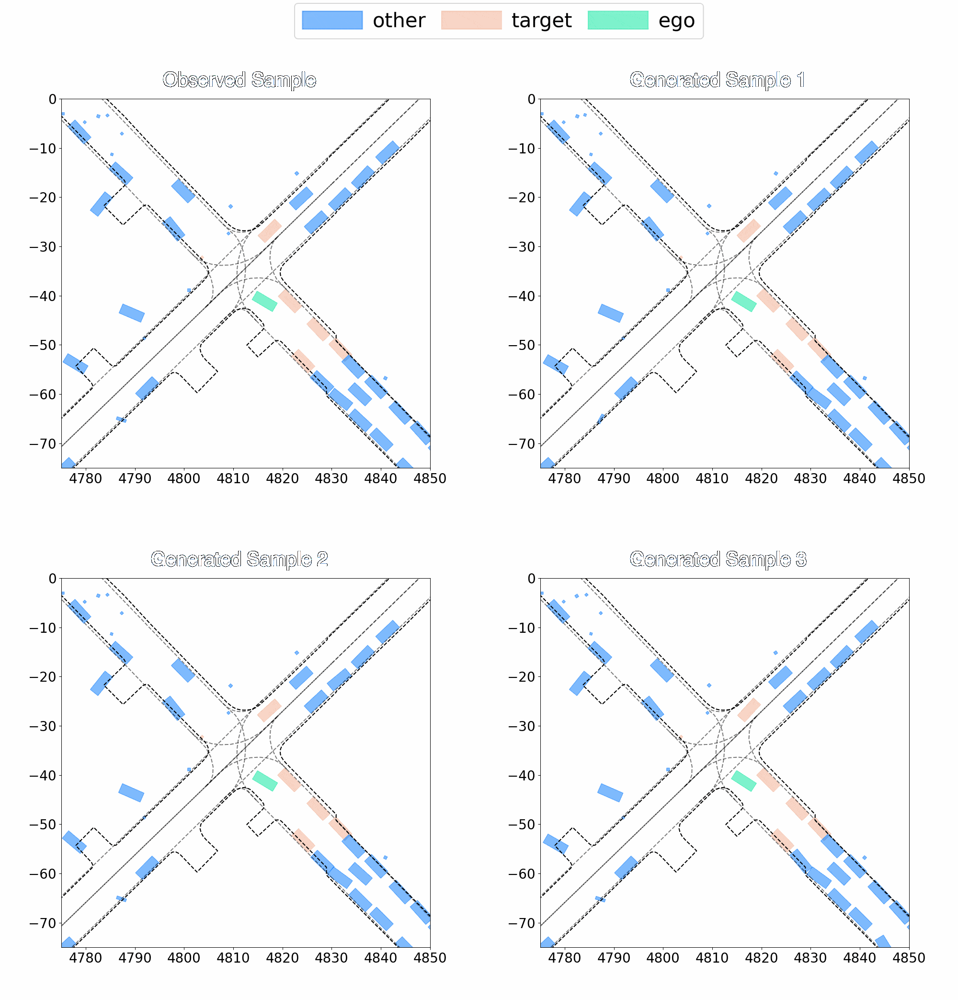
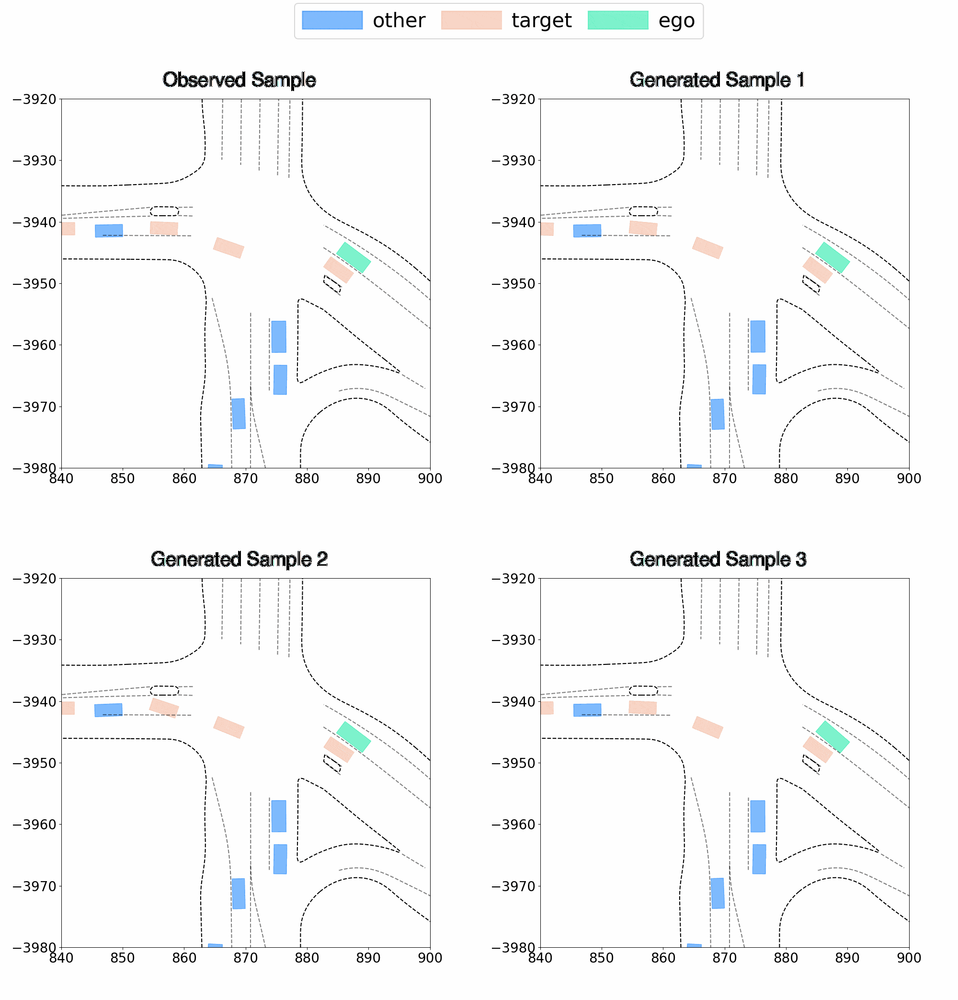

# Everything Polynomial Diffuser
>An efficient diffusion-based model for generating realistic traffic scene via polynomial representations.  
>This is the official repository of  
>**EP-Diffuser: An Efficient Diffusion Model for Traffic Scene Generation and Prediction via Polynomial Representations** [](https://arxiv.org/abs/2504.05422)

<table width="100%">
 <tr>
  <td align="center" width="100%">
    <br>
    <strong>Model Pipeline</strong>
  </td>
 </tr>
</table>


<table width="100%">
  <tr>
    <td align="center" width="50%">
      <br>
      <strong>Examples on Argoverse 2 (In-Distribution)</strong>
    </td>
    <td align="center" width="50%">
      <br>
      <strong>Examples on Waymo (Out-of-Distribution)</strong>
    </td>
  </tr>
</table>

## Getting Started
### 1. Setup Environment
**Step 1**: Clone this repository:
```
git clone https://github.com/continental/EP-Diffuser.git
cd EP_Diffuser
```

**Step 2**: Create a new conda environment and install required packages:
```bash
conda create -n ep_diffuser python=3.10
conda activate ep_diffuser

pip install -r requirements.txt
pip install torch_cluster==1.6.3
pip install torch_scatter==2.1.2
pip install torchmetrics==1.6.0
```

**Step 3**: Download the [Argoverse 2 Motion Forecasting Dataset](https://www.argoverse.org/av2.html) following the [Argoverse 2 User Guide](https://argoverse.github.io/user-guide/getting_started.html). The dataset should be organized as follows:
```
/data/argo2/
├── train/
|   ├── raw/
|   |   ├── aaaa-aaaa-aaaa/
|   |   ├── aaaa-aaaa-aaab/
|   |   ├── aaaa-aaaa-aaac/
└── val/
|   ├── raw/
|   |   ├── aaaa-aaaa-aaaa/
|   |   ├── aaaa-aaaa-aaab/
|   |   ├── aaaa-aaaa-aaac/
```

**Step 4**: Download [Waymo Open Motion Dataset](https://waymo.com/open/data/motion/) (we use the `scenario protocol`). Same as Argoverse 2, organize the Waymo dataset as follows:
```
/data/waymo/
├── train/
|   ├── raw/
|   |   ├── training.tfrecord-00000-of-01000/
|   |   ├── training.tfrecord-00001-of-01000/
|   |   ├── training.tfrecord-00002-of-01000/
└── val/
|   ├── raw/
|   |   ├── validation.tfrecord-00000-of-00150/
|   |   ├── validation.tfrecord-00001-of-00150/
|   |   ├── validation.tfrecord-00002-of-00150/
```

### 2. Preprocessing

To start preprocessing for Argoverse 2, run:
```
python preprocess.py --root data/argo2/ --dataset argoverse2
```

To start preprocessing for Waymo, run:
```
python preprocess.py --root data/waymo/ --dataset waymo
```

> **Note**  
> This preprocessing step will take considerable time.  
> It involves tracking trajectories of individual agents and fitting the map geometry.  
> The process will be slower initially but will accelerate as more maps are processed and cached.  
> Consider only preprocess the 'val' set of Waymo (e.g. only download the 'val' set)  

After completion, two new folders will be created alongside the existing `raw/` folder:

- `processed/`: Contains preprocessed data, including polynomial representations of trajectories and map geometry.
- `sim_agent/`: Contains transformed data required for computing Sim Agent metrics.


### 3. Training
To start training on Argoverse 2, run:
```
python train_ep_diffuser.py
```

> **Note**  
> Training on Argoverse 2 takes ~2 days on a single A10G.

### 4. Evaluation
Evluation on 500 most challenging subsamples of Argoverse 2:
```
python eval_sim_agent_argo2.py --ckpt_path checkpoints/EP_Diffuser/checkpoints/epoch\=63-step\=399872.ckpt --val_subsample_path pickle_files/500C_A2_scenario_ids.pkl 
```

Evluation on 20% random subsamples of Argoverse 2:
```
python eval_sim_agent_argo2.py --ckpt_path checkpoints/EP_Diffuser/checkpoints/epoch\=63-step\=399872.ckpt --val_subsample_path pickle_files/R20P_A2_scenario_ids.pkl 
```

Evluation on 500 challenging subsamples of Waymo:
```
python eval_sim_agent_waymo.py --ckpt_path checkpoints/EP_Diffuser/checkpoints/epoch\=63-step\=399872.ckpt --val_subsample_path pickle_files/500C_WO_scenario_ids.pkl 
```

Evluation on 20% random subsamples of Waymo:
```
python eval_sim_agent_waymo.py --ckpt_path checkpoints/EP_Diffuser/checkpoints/epoch\=63-step\=399872.ckpt --val_subsample_path pickle_files/R20P_WO_scenario_ids.pkl 
```

> **Note**  
> Calculating "Sim Agents" metrics is computationally expensive. For a more efficient alternative, consider using the [CAT-K](https://github.com/NVlabs/catk/blob/main/src/smart/metrics/wosac_metrics.py) implementation. (We do not include it in our repository due to licensing restrictions).  
> For visualization, please refer to the implementation provided in the [waymo-open-dataset](https://github.com/waymo-research/waymo-open-dataset/blob/master/src/waymo_open_dataset/utils/sim_agents/visualizations.py).  

### 5. Results and checkpoints
EP-Diffuser weights: [weights](checkpoints/EP_Diffuser/checkpoints).

**In-Distribution Quantitative Results (6s Prediction Horizon)**

| Sub-samples | Train/Test | Realisim Meta| Kinematic | Interaction | Map | minADE |
| :--- | :---: | :---: | :---: | :---: | :---: | :---: |
| R20P | A2/A2 | 0.809 | 0.632 | 0.808 | 0.913 | 0.398 |
| 500C | A2/A2 | 0.713 | 0.507 | 0.707 | 0.838 | 0.546 |


**Out-of-Distribution Quantitative Results (4.1s Prediction Horizon)**

| Sub-samples | Train/Test | Realisim Meta| Kinematic | Interaction | Map | minADE |
| :--- | :---: | :---: | :---: | :---: | :---: | :---: |
| R20P | A2/WO | 0.788 | 0.491 | 0.834 | 0.900 | 0.348 |
| 500C | A2/WO | 0.742 | 0.456 | 0.782 | 0.854 | 0.372 |

> **Note**  
> Results may slightly vary from the reported values due to the inherent randomness in generation process.

## Citation

If you find this repo useful, please consider giving us a star 🌟 and citing our related paper.

```bibtex
@article{yao2025ep,
    title={EP-Diffuser: An Efficient Diffusion Model for Traffic Scene Generation and Prediction via Polynomial Representations},
    author={Yue Yao and Mohamed-Khalil Bouzidi and Daniel Goehring and Joerg Reichardt},
    year={2025},
    journal={https://arxiv.org/abs/2504.05422}
}
```

## Acknowledgements

This repo benefits from [QCNet](https://github.com/ZikangZhou/QCNet/), [Forecast-MAE](https://github.com/jchengai/forecast-mae), [OptTrajDiff](https://github.com/YixiaoWang7/OptTrajDiff). Thanks for their great works.